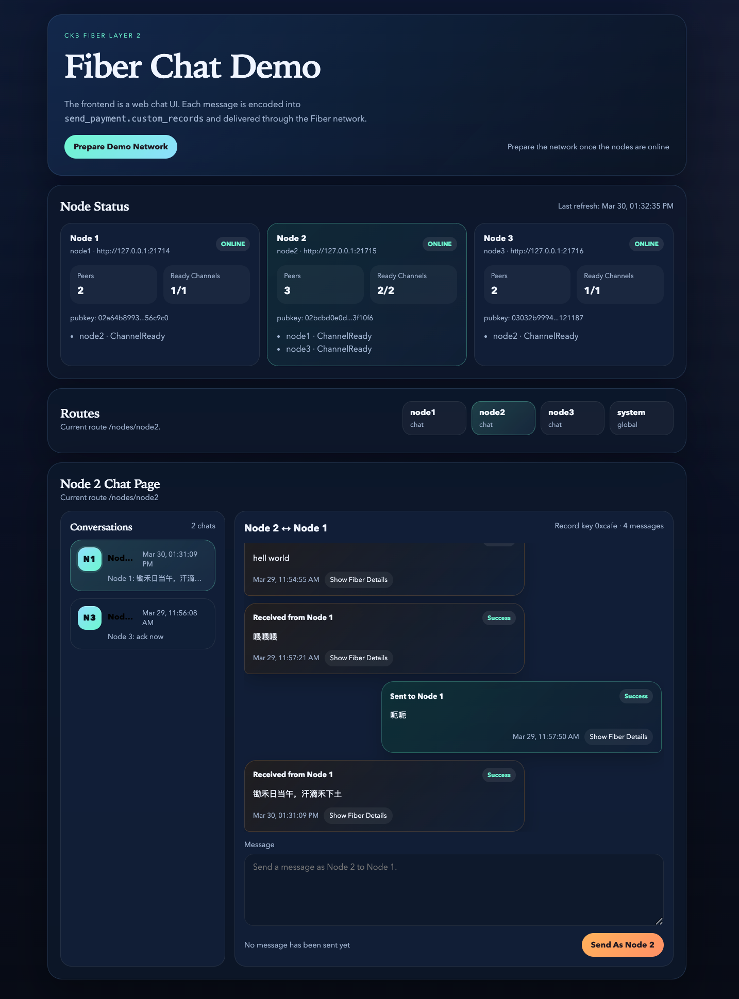

# Fiber Chat Demo

This is a minimal runnable chat demo based on [Fiber Network](https://github.com/nervosnetwork/fiber).

Fiber Network is a layer-2 protocol built on top of the Nervos CKB blockchain, enabling fast and secure off-chain transactions. This demo showcases how to use Fiber's payment sessions and custom records to implement a simple chat application.

It is *decentralized* in the sense that each participant runs their own Fiber node, and messages are sent through netowrk's channels, it's safe since middle hops can not decode the inline messages within onion packets.

However, for simplicity, this demo runs all nodes locally and uses a backend service to poll for messages.

---

- The frontend is a web chat UI
- The backend is a Rust HTTP service
- Messages are transported through Fiber `send_payment.custom_records`

Each chat message is encoded as JSON and written into the fixed record key `0xcafe`.
Every message triggers a tiny keysend payment underneath.



## Run

1. Start the Fiber network and the demo service together

```bash
./start.sh
```

Then after it finishing, open the web UI at:

```text
http://127.0.0.1:3000
```

If you want to fully rebuild the local dev chain:

```bash
REMOVE_OLD_STATE=y ./start.sh
```

If you only want to clear Fiber store state:

```bash
REMOVE_OLD_FIBER=y ./start.sh
```

## Docker

Build the container image:

```bash
docker build --platform linux/amd64 -t ckb-chat-demo .
```

Run it locally:

```bash
docker run --rm -p 3000:3000 ckb-chat-demo
```

The container bakes in `ckb`, `ckb-cli`, `fnn`, and the compiled `ckb-chat` server.

At runtime it still uses the same `./start.sh` orchestration, but without requiring Cargo inside the container.

## Structure

- `src/main.rs`: Rust backend for Fiber JSON-RPC calls, payment polling, demo network preparation, and web APIs
- `static/`: single-page frontend
- `bin/`: project-local directory for `ckb`, `ckb-cli`, and `fnn`
- `fiber-bundle/`: vendored Fiber node configs, keys, and dev-chain dependencies
- `scripts/install-binaries.sh`: installs the binaries needed by this project
- `scripts/start-fiber-network.sh`: starts the three reference nodes from the local bundle

## Current Tradeoff

Fiber's public RPC is still payment-session oriented and does not expose a direct inbox-style API for reading received `custom_records` from the receiver side.

So this demo uses a pragmatic local three-node approach:

- the backend polls `list_payments` on each local node
- it extracts only payments carrying the `0xcafe` chat record
- it reconstructs the chat timeline from those payment sessions
